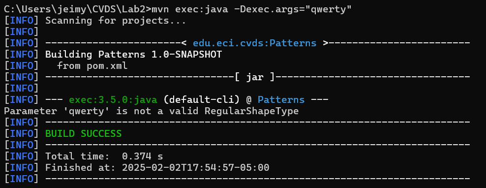

## Segundo Laboratorio de CVDS
**Integrantes:**  
- Alison Valderrama
- Jeimy Yaya
  
**Objetivo:**  
El objetivo de este laboratorio es aprender como se utiliza **Maven** para proyectos


## HERRAMIENTA MAVEN

### Cuál es su mayor utilidad
La mayor utilidad de Maven es que ayuda a gestionar proyectos o dependecias de este mismo ya que puede manejar la compilacion, los informes y la documentacíon lo que ayuda en la mejorar el mantenimiento y reusabilidad.

### Fases de Maven
Las fases de compilación representan cada etapa de ciclo de vida en este caso se dividen en 7 que son:
 -**`Validate`**
    Valida que el proyecto este correctamente y toda su información este disponible

 -**`Compile`**
    Se encarga de compilar todo el codigo fuente del proyecto

 -**`test`**
    Este se hace para probar el codigo fuente haciendo uso de las pruebas unitarias pero hay que tener en cuenta que las pruebas no deden estar empaquetadas

 -**`Package`**
    Se apropia de codigo compilado y empaquetado en su formato distribuible 

 -**`Verify`**
    Ejecuta cada fase del ciclo de vidapara comprabar los resultados de las pruebas de integración que garanticen que cumpla con los criterios de calidad

 -**`install`**
    Instalar el paquete en el repositorio local para utilizarlo como  dependencias en otros proyectos locales   

 -**`Validate`**
    Se encarga de Copiar el paquete final al repositorio remoto para compartirlo con otros desarrolladores   

### Ciclo de vida de la construcción
 -**`Clean`**
    Se encarga de limpiar la compilación del proyecto.

 -**`Default`**
    Controla el proceso de construcción del proyecto.

 -**`Site`**
    Se encarga de comprobar la creacion de la documentación del proyecto.

### Para qué sirven los plugins
 Los plugin son componentes que realizan una tarea durante un proceso de construcción por ejemplo
 
 -Compilar el codigo
 
 -Crear un archivo Jar
 
 -Generar la documentación de un proyecto
 
Es decir que son una pieza de software que permite a otro sistema informatico realizar acciones que no están incluidas en el código.

### Qué es y para qué sirve el repositorio central de maven
El repositorio cebtral de Maven se usa para el almacenamiento de bibliotecas Java,Complementos y otros artefactos de la construcción de un proyecto una pequeña observación es que los repositorios pueden ser locales o remotos y se diferencian en:
 - El local es un directorio en la computadora donde se ejecuta Maven. Almacena en caché las descargas remotas y contiene artefactos de compilación temporales que aún no ha publicado.
 - El remoto hace referencia a cualquier otro tipo de repositorio al que se accede mediante una variedad de protocolos, como file://y https://.


## CREAR UN PROYECTO CON MAVEN
Buscar cómo se crea un proyecto maven con ayuda de los arquetipos (archetypes) y buscar cómo ejecutar desde línea de comandos el objetivo "generate" del plugin "archetype", con los siguientes parámetros:

### El arqueotipo es el siguiente:

  ```mvn archetypes:generate -DgroupId=edu.eci.cvds -DartifactId=Patterns -DarchetypeArtifactId=maven-archetype-quickstart -DarchetypeVersion=1.0 -Dpackage=edu.eci.cvds.patterns.archetype -DinteractiveMode=False```


Para ver el conjunto de archivos y directorios creados por el comando mvn ejecute el comando tree.


## AJUSTAR ALGUNAS CONFIGURACIONES EN EL PROYECTO

Edite el archivo pom.xml y realize la siguiente actualización:

  -  Hay que cambiar la version del compilador de Java a la versión 8, para ello, agregue la sección properties antes de la sección de dependencias:

  

## COMPILAR Y EJECUTAR
Para compilar ejecute el comando:

- mvn package


Busque cuál es el objetivo del parámetro "package" y qué otros parámetros se podrían enviar al comando mvn.

---
Ejecutar nuevamente la clase desde línea de comandos y verificar la salida: Hello World!


Utilizar la primera posición del parámetro que llega al método "main" para realizar elsaludo personalizado, en caso que no sea posible, se debe mantener el saludo como se encuentra actualmente:


Ejecutar la clase desde línea de comandos enviando su nombre como parámetro y verificar la salida. Ej: Hello Pepito!


Ejecutar la clase con su nombre y apellido como parámetro. ¿Qué sucedió?


Ejecutar nuevamente y verificar la salida en consola. Ej: Hello Pepito Perez!


## HACER EL ESQUELETO DE LA APLICACIÓN

Analice y asegúrese de entender cada una de las instrucciones que se encuentran en todas las clases que se crearon anteriormente. Cree el archivo ShapeFactory.java en el directorio src/main/java/edu/eci/cvds/patterns/shapes implementando el patrón fábrica (Hint: https://refactoring.guru/design-patterns/catalog), haciendo uso de la instrucción switch-case de Java y usando las enumeraciones.


## ¿Cuál fábrica hiciste? y ¿Cuál es mejor?
El patron que implementamos fue **Simple Factory** que se basa en encapsular la creacion de objetos en un solo método estatico, lo que nos permite crear instancias de diferentes clases


Ejecute múltiples veces la clase ShapeMain, usando el plugin exec de maven con los siguientes parámetros y verifique la salida en consola para cada una:

 - Sin parámetros

 

 - Parámetro: qwerty

 

 - Parámetro: pentagon

 

 - Parámetro: Hexagon

 


¿Cuál(es) de las anteriores instrucciones se ejecutan y funcionan correctamente y por qué?

- Las instrucciones con pentagon y hexagon funcionan correctamente, ya que son formas reconocidas y están implementadas en el código.

- La ejecución sin parámetros o con qwerty puede fallar si el programa no maneja adecuadamente estos casos. Se puede agregar validaciones para evitar errores y mostrar mensajes.


---

## REFERENCIAS

https://maven.apache.org/guides/introduction/introduction-to-repositories.html


